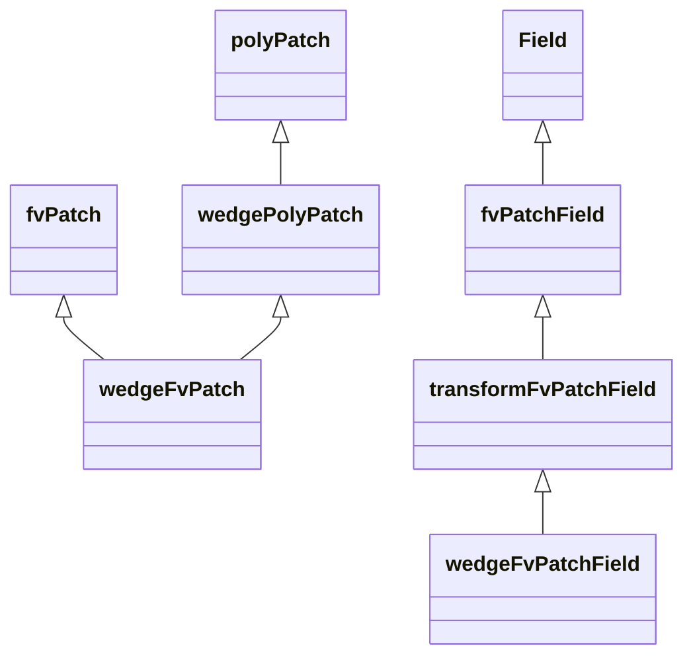
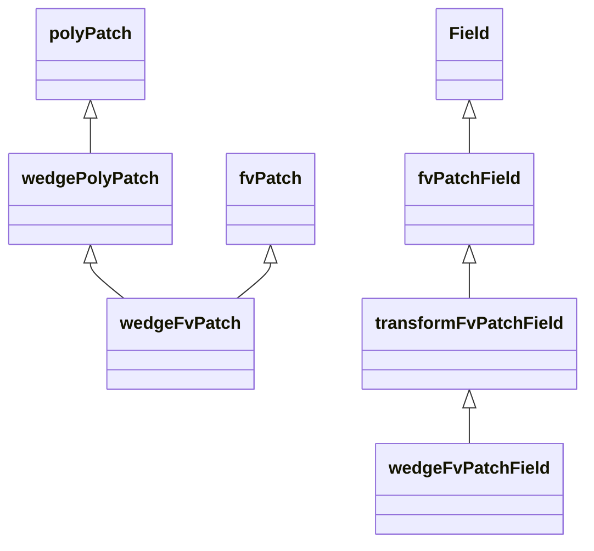
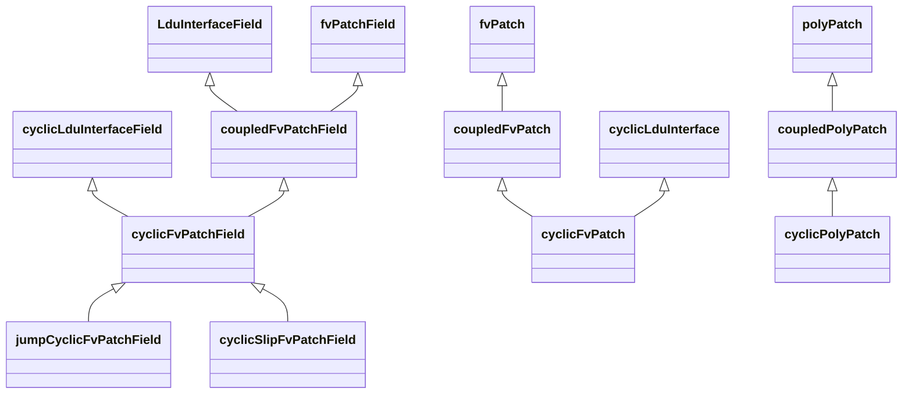

### Begin

关键词：Axisymmetric

[Wedge boundary condition and the math behind it??????? -- CFD Online Discussion Forums (cfd-online.com)](https://www.cfd-online.com/Forums/openfoam-solving/186540-wedge-boundary-condition-math-behind.html)

>I don't have any documented reference about how wedges work in OpenFOAM, but as far as I know, the concept is that the wedge boundary is a special type of cyclic boundary condition.
>The difference is that:
>
>- Cyclic boundaries assume that the adjacent cell to the boundary will be part of a domain and not part of the other corresponding cyclic boundary (that's one of the reasons why "empty" exists).
>- Wedges act as a one-to-one cyclic boundary that only has to care about a single cell for each wedge-face-pair.
>
>This also means that a wedge can allow rotational flow around the axis, which would explain why a 90 degree cylinder with symmetry boundaries would not give the same results as with the wedge.
>
>
>However, there are considerable limitations when using wedges: the cells near the axis can have extremely small volumes (OpenFOAM usually only works in 3D, so cell volumes always count), which can result in considerable numerical problems, given that the data is not handled as a 2D case that only accounts for face area.
>
>
>Furthermore, there have been a few cases that I've seen that the wedge face pairs are too close to each other, that it's not possible to numerically have a significance difference between the centers of those faces. For example, a worst case scenario would be to have a distance smaller than the diameter of a single molecule of water... which is *reaaaally* small and something that only specialized CFD solvers can handle.


>  Therein, it's concluded that the OpenFoam solver requires a **5 degree** wedge


[OpenFOAM v11 User Guide - 5.3 Mesh boundary (cfd.direct)](https://doc.cfd.direct/openfoam/user-guide-v11/boundaries)


[Master_Thesis_Giacomo_Quattrucci_4820428.pdf](file:///Users/tongyanjun/Downloads/A-edgeDownloads/Master_Thesis_Giacomo_Quattrucci_4820428.pdf)

> for RANS simulation the approach is based on exploiting the small computational effort required by the solver. Therefore, since the problem and associated physical averaged quantities are axis-symmetric, the pipe was simplified by two-dimensional wedge geometry that represents only a slice of the total cylinder.


[openfoam中cyclic周期性边界的问题 (cfd-china.com)](https://www.cfd-china.com/topic/1150/openfoam中cyclic周期性边界的问题/9)

> 这里面谈及的之前遇到的`internalCoeffs_`与`boundaryCoeffs_`。讨论了这两个的含义。这个回答很有意思，感觉可以回答之前的"Why using LDU in OpenFOAM"的问题。
>
> 


NOTE：在`MULESTemplates.C`中，还发现MULES算法对`wedge`边界条件做了单独的分支判断。


Versteeg书中，关于施加边界条件的讨论


> In Chapters 4 and 5 we saw that boundary conditions enter the discretised equations by suppression of the link to the boundary side and modification of the source terms.
>
> “在这里，“suppression of the link to the boundary”意味着在离散方程中通过取消与边界侧的链接来处理边界条件。这可以理解为在边界处将与边界相关的项或链接移除，以确保在边界处正确处理边界条件。通过这种方式，可以有效地将边界条件纳入离散方程中，确保数值模拟的准确性和稳定性。”


#### Jasak_five_basic_classes_in_OF

其中有一页是关于边界条件的论述：

Finite Volume Boundary Conditions

• Implementation of boundary conditions is a perfect example of a virtual class hierarchy

• Consider implementation of a boundary condition

◦ Evaluate function: calculate new boundary values depending on **behaviour**:

fixed value, zero gradient etc.

◦ Enforce boundary type constraint based on matrix coefficients

◦ Multiple if-then-else statements throughout the code: asking for trouble

◦ **Virtual function interface**: run-time polymorphic dispatch

• Base class: fvPatchField

◦ Derived from a field container

◦ Reference to fvPatch: easy data access

◦ Reference to internal field

• Types of fvPatchField

◦ **Basic**: fixed value, zero gradient, mixed, coupled, default

◦ **Constraint**: enforced on all fields by the patch: cyclic, empty, processor, symmetry, wedge, GGI

◦ **Derived**: wrapping basic type for physics functionality


【翻译】

• 边界条件的实现是虚类层次结构的完美示例

• 考虑边界条件的实现

◦ `Evaluate`函数：根据**行为**计算新的边界值：

固定值、零梯度等

◦ 根据矩阵系数强制边界类型约束

◦ 代码中遍布多个 if-then-else 语句：自找麻烦

◦ **虚函数接口**：运行时多态分发

• 基类：`fvPatchField`

◦ 派生自场`Field`容器

◦ 引用 `fvPatch`：轻松访问数据

◦ 引用内部场

• fvPatchField 的类型

◦ **Basic**：固定值、零梯度、混合、耦合、默认

◦ **Constrain**：由补丁对所有字段强制执行：循环、空、处理器、对称、楔形、GGI

◦ **Derived**：为物理功能包装基本类型


【阅读补充】

在C++中，"virtual class hierarchy" 意味着使用虚拟函数实现的类层次结构。当一个基类中的函数被声明为虚函数时，在派生类中可以通过重写（override）这个函数来实现多态性。这使得在运行时能够根据对象的实际类型来调用对应的函数，而不是根据引用或指针的类型来确定。通过使用虚拟函数和多态性，可以更灵活地设计和实现类之间的关系，实现更高级的抽象和封装，提高代码的可维护性和可扩展性。


### Intermediate

#### 网上讨论

[How the boundary conditions are called in the OpenFOAM solvers? -- CFD Online Discussion Forums (cfd-online.com)](https://www.cfd-online.com/Forums/openfoam-programming-development/129271-how-boundary-conditions-called-openfoam-solvers.html)

> 这个关于边界条件的讨论很好，有Jasak的回答：
>
> \- on correctBoundaryConditions() for a field
> \- on updateCoeffs() at matrix creation
>
> correctBoundaryConditions is also called after the linear solver call automatically.


[How have boundary values set for calculated variables -- CFD Online Discussion Forums (cfd-online.com)](https://www.cfd-online.com/Forums/openfoam-solving/60051-how-have-boundary-values-set-calculated-variables.html)

> If you want to specify J at the boundary, you will need to create it given a list of boundary patch types. If you give nothing (this is what happens now), you will get a calculated type for the boundary patch field, which is a default choice.
>
> OpenFOAM also has boundaries whoe type is constrained by the mesh definition, e.g. empty, processor, symmetry, cyclic and wedge. This will be handled automatically, i.e. the code won't let you specify a fixed value patch type on the symmetry boundary.


[OpenFOAM矩阵组装的系统介绍(全) - 知乎 (zhihu.com)](https://zhuanlan.zhihu.com/p/366736087)


这篇帖子里对`::New`函数的说明和之前的内容对上了。这种return一个`::New`的方式就是OpenFOAM的`RTS`选择机制。


从网上的讨论内容来看，边界条件对OpenFOAM求解过程的影响需要单独整理分析。

[边界条件对OpenFOAM求解过程的影响](./边界条件对OpenFOAM求解过程的影响.md)


#### 算例测试


tttt:经测试，使用wedge边界条件，监测两个wedge边界处的面face area vector。`mesh.boundary()[patchI].Sf()[cellI]`，大小相等，方向相反。


### wedge相关类

版本：OpenFOAM-v2106。从后面的类图来看（对比了OpenFOAM-v2106和OpenFOAM-7的`wedge`相关类的继承关系图），OpenFOAM-v2106和OpenFOAM-7的`wedge`相关类类似。


#### wedgeFvPatchField

类描述：`This boundary condition is similar to the cyclic condition, except that it is applied to 2-D geometries.`

在OpenFOAM代码的类描述中谈到`wedge`边界条件：这个类除了在2D情况下，与周期性边界条件类似。


##### Public member function

```C++
// 运行时选择相关
TypeName(wedgeFvPatch::typeName_())
```


```C++
// 该函数返回一个tmp指针，该指针指向一个new出来的wedgeFvPatch对象（new的时候的wedgeFvPatch对象掉用拷贝构造，以达到克隆的效果）。
virtual tmp< fvPatchField< Type > > 	clone () const

// 该函数多传入一个场量，return时候，new的wedgeFvPatch对象调用的构造函数为：wedgeFvPatchField (const fvPatch &, const DimensionedField< Type, volMesh > &)
virtual tmp< fvPatchField< Type > > 	clone (const DimensionedField< Type, volMesh > &iF) const

```


```C++
// 返回边界处的梯度
virtual tmp< Field< Type > > 	snGrad () const

  // 计算并返回边界面的梯度值
tmp< scalarField > 	snGrad () const
```

假设我们有一个函数$F(x)$，其中$x$表示空间中的位置坐标。那么，这段代码可以抽象为以下数学公式：

$$
\text{snGrad}(F(x)) = \left( \text{transform}(T(x), F_{\text{internal}}(x)) - F_{\text{internal}}(x) \right) \times \left(0.5 \times \Delta(x)\right)
$$

其中，
- $\text{snGrad}(F(x))$ 表示函数$F(x)$在边界面上的梯度；
- $\text{transform}(T(x), F_{\text{internal}}(x))$ 表示将边界类型$T(x)$和内部场量$F_{\text{internal}}(x)$进行转换操作；
- $F_{\text{internal}}(x)$ 表示边界面的内部场量；
- $\Delta(x)$ 表示边界的delta系数。


`evaluate()`函数中涉及到对矩阵系数的修改`this->updateCoeffs()`以及坐标变换`transform()`

```C++
virtual void 	evaluate (const Pstream::commsTypes commsType=Pstream::commsTypes::blocking)
void 	evaluate (const Pstream::commsTypes commsType)
void 	evaluate (const Pstream::commsTypes)
```


```C++

virtual tmp< Field< Type > > 	snGradTransformDiag () const
```


其中函数`snGrad()`以及`evaluate()`涉及到旋转函数`transform`的使用。`transform(T,a)`表示用张量`T`来变换张量`a`。例如`snGrad()`函数，通过`this->patchInternalField()`获取靠近边界处的内部场，将该内部场返回为patch场`pif`。该patch场通过旋转函数`transform()`，通过计算得到的旋转张量，将其转到某个地方。该函数的旋转数学表达式含义还不清楚。但可以猜测其是从一个patch处旋转到另外一个patch。其中的`this->patch().deltaCoeffs()`会返回face - cell的距离系数。

```C++
template<class Type>
Foam::tmp<Foam::Field<Type>> Foam::wedgeFvPatchField<Type>::snGrad() const
{
    const Field<Type> pif(this->patchInternalField());
 
    return
    (
        transform(refCast<const wedgeFvPatch>(this->patch()).cellT(), pif) - pif
    )*(0.5*this->patch().deltaCoeffs());
}
```

> 函数`transform()`定义在文件`transformField()`中。其中包含多种接口的transform函数，其底层会调用`FieldM.H`中的宏函数，从而完成坐标变换。


##### 构造函数

`wedgeFvPatchField`类的构造函数，都会委托给它的父类`transformFvPatchField`进行构造，如代码：

```C++
template<class Type>
Foam::wedgeFvPatchField<Type>::wedgeFvPatchField
(
    const fvPatch& p,
    const DimensionedField<Type, volMesh>& iF
)
:
    transformFvPatchField<Type>(p, iF)
{}
```

提供的多种参数的构造，拷贝构造，均委托给父类`transformFvPatchField`构造。

```C++
wedgeFvPatchField (const fvPatch &, const DimensionedField< Type, volMesh > &)

wedgeFvPatchField (const fvPatch &, const DimensionedField< Type, volMesh > &, const dictionary &)
 
	// 该构造函数
  // 采用of (!isType<wedgeFvPatch>(this->patch()))判断进行防御性编程
wedgeFvPatchField (const wedgeFvPatchField< Type > &, const fvPatch &, const DimensionedField< Type, volMesh > &, const fvPatchFieldMapper &)  
  
wedgeFvPatchField (const wedgeFvPatchField< Type > &)
  
wedgeFvPatchField (const wedgeFvPatchField< Type > &, const DimensionedField< Type, volMesh > &)  
```


#### wedgeFvPatch

该类继承自`fvPatch`以及`wedgePolyPatch`，能够用父类的很多成员函数。

其中的公有成员函数`faceT()`和`cellT()`分别为面的旋转张量以及cell的旋转张量。其实现是通过private的`wedgePolyPatch`对象`wedgePolyPatch_`调用`wedgePolyPatch`的成员函数完成。所以，`faceT()`及`cellT()`的具体实现要看其父类`wedgePolyPatch`。

```C++
            //- Return face transformation tensor
            const tensor& faceT() const
            {
                return wedgePolyPatch_.faceT();
            }
 
            //- Return neighbour-cell transformation tensor
            const tensor& cellT() const
            {
                return wedgePolyPatch_.cellT();
            }
```


#### wedegePolyPatch

该类下涉及`wedge`相关的一系列计算几何。涉及到对称轴计算，`wedge`边界中心点处的法向量，壁面法向计算，两`wedge`边界条件之间角度的`cos`值，以及`face`和`Neighbour-cell`转动张量

```C++

        //- Axis of the wedge
        vector axis_;
 
        //- Centre normal between the wedge boundaries
        vector centreNormal_;
 
        //- Normal to the patch
        vector n_;
 
        //- Cosine of the wedge angle
        scalar cosAngle_;
 
        //- Face transformation tensor
        tensor faceT_;
 
        //- Neighbour-cell transformation tensor
        tensor cellT_;
```

- 该类下`faceT()`，`cellT()`，角度`cosAngle_`等成员变量均在其中成员函数`calcGeometry`中计算。

  ```C++
  void Foam::wedgePolyPatch::calcGeometry(PstreamBuffers&)
  {
    //...
            n_ = gAverage(nf);
    //...
            centreNormal_ =
              vector
              (
                  sign(n_.x())*(max(mag(n_.x()), 0.5) - 0.5),
                  sign(n_.y())*(max(mag(n_.y()), 0.5) - 0.5),
                  sign(n_.z())*(max(mag(n_.z()), 0.5) - 0.5)
              );
          centreNormal_.normalise();
   
          cosAngle_ = centreNormal_ & n_;
    //...
          faceT_ = rotationTensor(centreNormal_, n_);
          cellT_ = faceT_ & faceT_;
  }
  ```

- 其中的函数`rotationTensor`本质为找到张量A转动到张量B的转动矩阵。经查阅，与如下公式类似：


### 类图

调研OpenFOAM-7以及OpenFOAM-v2106中`wedge`相关类的继承层级关系

#### OpenFOAM-7




#### OpenFOAM-v2106




路径：`/src/finiteVolume/fvMesh/fvPatches/constrint/wedge/wedgeFvPatch*`

路径：`/src/finiteVolume/fields/fvPatchFields/constraint/wedge/wedgeFvPatchField*`


#### Sum

1. `OpenFOAM-7`与`OpenFOAM-v2106`的继承关系相同。 在`OpenFOAM-v2106`的header中看到版权归属于`OpenFOAM Foundation`。所以这两个版本的`OpenFOAM`的wedge实现应该类似。
2. `wedgeFvPatch`通过头文件形式在`wedgeFvPatchField`中被引用。


### wedge边界条件与旋转周期边界条件

**目标**：`wedgeFvPatchField`代码内有其与`cyclicFvPatchField`的相似说明（"This boundary condition is similar to the cyclic condition, except that it is applied to 2-D geometries."）。可以猜想，wedge边界条件和旋转周期性边界条件非常相似。


注：之前使用的周期性边界条件场景为平移边界条件，旋转周期边界在OpenFOAM中，是否在同一个类中？


#### cylic相关类

`cyclic`与`wedge`的继承链相似的地方在于，其顶层父类都有`fvPatchField`。



> 补充`fvPatchField`类的描述：
>
> Abstract base class with a fat-interface to all derived classes covering all possible ways in which they might be used.
>
> The first level of derivation is to basic patchFields which cover zero-gradient, fixed-gradient, fixed-value and mixed conditions.
>
> The next level of derivation covers all the specialised types with specific evaluation procedures, particularly with respect to specific fields.


##### cyclicFvPatchField

该类下有几个值得注意的成员函数：

```C++
//- 判断patch场是否需要进行transform操作
virtual bool 	doTransform () const
//- 与wedgeFvPatch中的faceT()作用相同
virtual const tensorField & 	forwardT () const
//- 与wedgeFvPatch中的cellT()作用相同
virtual const tensorField & 	reverseT () const
```

这些成员函数功能与`wedgeFvPatch`中`faceT()`以及`cellT()`类似，也是通过调用函数`rotationTensor`计算得到一个旋转张量。这些函数的实现也是在其父类`coupledPolyPatch`中实现

```C++

void Foam::coupledPolyPatch::calcTransformTensors
{
          if
        (
            transform == ROTATIONAL
         || (
                transform != TRANSLATIONAL
             && transform != COINCIDENTFULLMATCH
             && (sum(mag(nf & nr)) < Cf.size() - error)
            )
        )
          {
            //...判断如果边界条件时rotational的
          forAll(forwardT_, facei)
            {
                forwardT_[facei] = rotationTensor(-nr[facei], nf[facei]);
                reverseT_[facei] = rotationTensor(nf[facei], -nr[facei]);
            }
          }
}
```

但是，其与`wedge`相关实现存在差别，见图。更加深入的差别待调研，可以先通过同一个算例的`cyclic`和`wedge`边界条件的计算结果对比来明确其差距。


##### coupledPolyPatch

关于旋转的选择是在该类下定义一个枚举类`transformType`

```C++
const Foam::Enum
<
    Foam::coupledPolyPatch::transformType
>
Foam::coupledPolyPatch::transformTypeNames
({
    { transformType::UNKNOWN, "unknown" },
    { transformType::ROTATIONAL, "rotational" },
    { transformType::TRANSLATIONAL, "translational" },
    { transformType::COINCIDENTFULLMATCH, "coincidentFullMatch" },
    { transformType::NOORDERING, "noOrdering" },
});
```


如在OpenFOAM-7中的`OpenFOAM-7/tutorials/incompressible/SRFSimpleFoam/mixer/system/blockMeshDict`。可以设置为旋转周期边界。

```C++
121     cyclic_half0
122     {
123         type cyclic;
124         neighbourPatch cyclic_half1;    
125         transform rotational;
126         rotationAxis (0 0 1);
127         rotationCentre (0 0 0);
128         faces 
129         (     
130             (0 9 21 12)    
131             (10 0 12 22)   
132         );    
133     } 
134     cyclic_half1
135     { 
136         type cyclic;       
137         neighbourPatch cyclic_half0;    
138         transform rotational;
139         rotationAxis (0 0 1);
140         rotationCentre (0 0 0);
141         faces 
142         (     
143             (3 15 20 8)    
144             (11 23 15 3)   
145         );    
146     }
```

而OpenFOAM在实际使用的该边界条件时，一般只需要在初始场中设置为`type cyclic`或加上初始值，并不会在场文件中指定旋转轴。


### 猜想


矩阵求解的过程中包含边界条件的影响。例如，在求解器中的`solve()`中，可能包含边界条件对矩阵系数影响的修正。


例如之前做的在一维导热情况下的：

```C++
// Assigning contribution from BC
forAll(T.boundaryField(), patchI)
{
    const fvPatch &pp = T.boundaryField()[patchI].patch();
    forAll(pp, faceI)
    {
        label cellI = pp.faceCells()[faceI];
        A[cellI][cellI] += TEqn.internalCoeffs()[patchI][faceI];
        A.source()[cellI] += TEqn.boundaryCoeffs()[patchI][faceI];
    }
}
```


### 总结

1. `wedge`边界条件和`cyclic`边界条件存在很多相似的地方。相同之处在于都采用`transform`函数进行坐标变换。较大的差别在于`wedge`边界涉及到角度计算
2. `wedge`边界条件和`cyclic`旋转边界的旋转（坐标变换）数学意义不确定相同
3. 旋转周期边界和`wedge`是否能通用需要进一步调研与测试
4. `wedge`用于轴对称和球对称，需要对wedge的角度进行坐标变换，而不是简单的镜像对应的patch。


